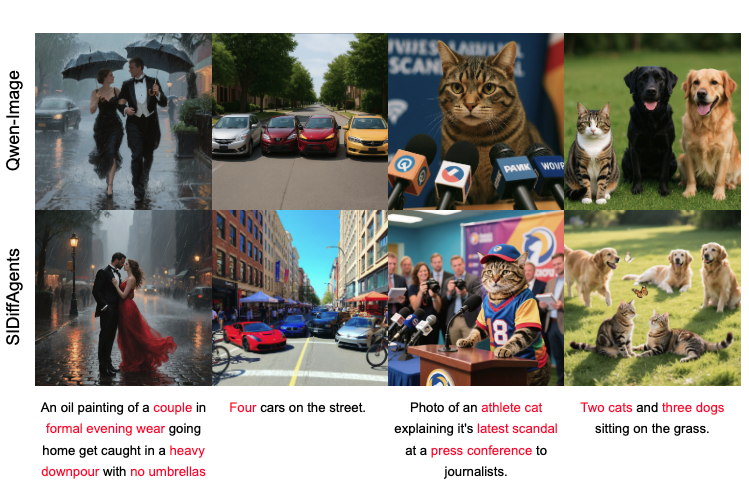
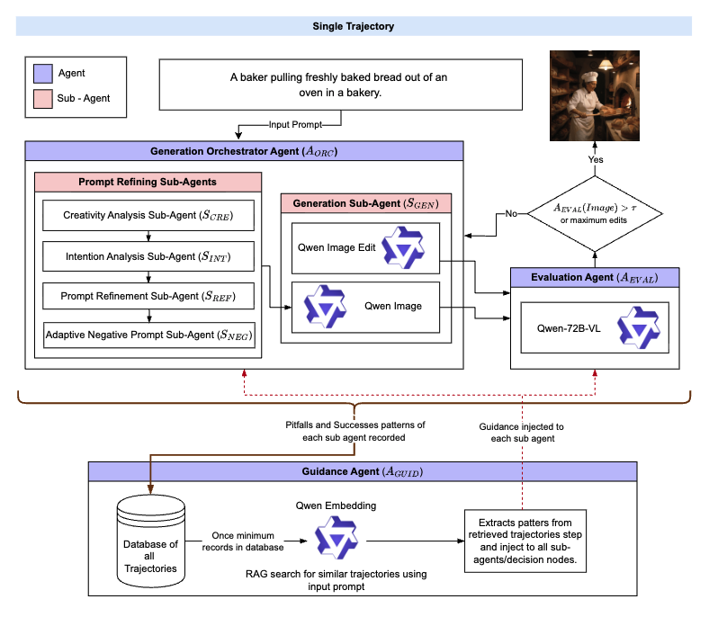
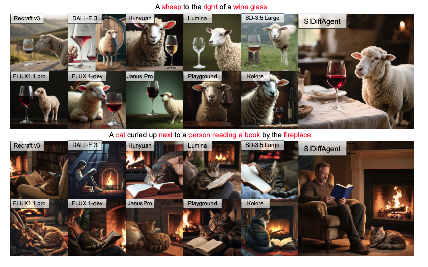

# SIDIFFAGENT: SELF-IMPROVING DIFFUSION AGENT

<!-- <div align="center">

[](8627_SIDiffAgent_Self_Improvin%20(3).pdf)
[]()
[]()

</div> -->

<p align="center">
  
</p>

## 📋 Abstract

Text-to-image diffusion models have revolutionized generative AI, enabling high-quality and photorealistic image synthesis. However, their practical deployment remains hindered by several limitations: sensitivity to prompt phrasing, ambiguity in semantic interpretation (e.g., `mouse` as animal vs. a computer peripheral), artifacts such as distorted anatomy, and the need for carefully engineered input prompts. Existing methods often require additional training and offer limited controllability, restricting their adaptability in real-world applications. We introduce **Self-Improving Diffusion Agent (SIDiffAgent)**, a training-free agentic framework that leverages the Qwen family of models (Qwen-VL, Qwen-Image, Qwen-Edit, Qwen-Embedding) to address these challenges. SIDiffAgent autonomously manages prompt engineering, detects and corrects poor generations, and performs fine-grained artifact removal, yielding more reliable and consistent outputs. It further incorporates iterative self-improvement by storing a memory of previous experiences in a database. This database of past experiences is then used to inject prompt-based guidance at each stage of the agentic pipeline. SIDiffAgent achieved an average VQA score of 0.884 on GenAIBench, significantly outperforming open-source, proprietary models and agentic methods. We will publicly release our code upon acceptance.

## 🏗️ Architecture

<p align="center">
  
</p>

Workflow of the Self-Improving Diffusion Agent (**SIDiffAgent**). An input prompt is processed by the Generation Orchestrator Agent (A_ORC), which employs sub-agents (S_CRE, S_INT, S_REF, S_NEG) to assess creativity, clarify intent, refine the prompt, and add adaptive negative constraints before generation (S_GEN). The Evaluation Agent (A_EVAL) scores the generated image on aesthetic quality and text–image alignment, triggering targeted refinements if the evaluation score is less than the pre-defined threshold `tau`. Each trajectory is stored in the knowledge base, where the Guidance Agent (A_GUID) stores pitfalls and successes into corrective and workflow guidance, which are injected back into decision nodes to improve future generations.

## 📊 Results

<p align="center">
  
</p>

**Qualitative comparison of SIDiffAgent with 10 state-of-the-art models on challenging prompts from DrawBench (Top) and GenAI-Bench (Bottom).** SIDiffAgent demonstrates superior handling of spatial relationships (correctly placing the sheep `to the right of` the glass) and compositional complexity (generating all elements of the cat, person, and fireplace scene). In contrast, other models frequently exhibit errors in spatial awareness and object omission.

## 🚀 Quick Start

### Installation

```bash
# 1. Clone the repository
git clone https://github.com/ayushsi42/agents-image-gen.git
cd agents-image-gen

# 2. Create conda environment
conda env create -f environment.yaml
conda activate t2i_copilot

# 3. Set up OpenAI API key
echo "OPENAI_API_KEY=<YOUR_KEY_HERE>" > .env

# 4. Install required packages
pip install diffusers